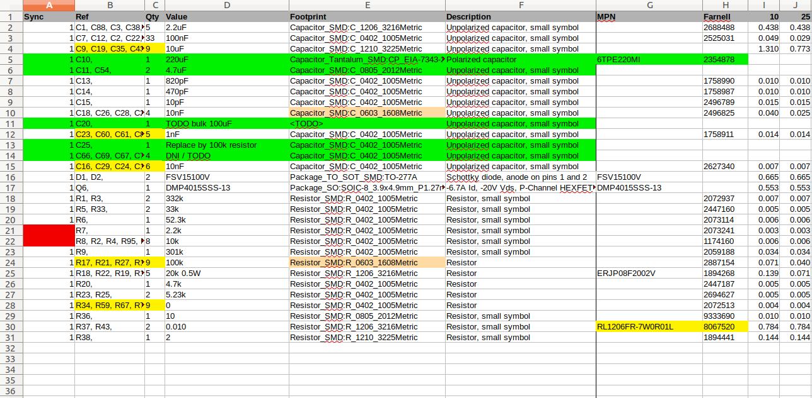
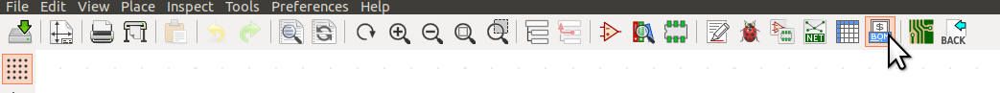
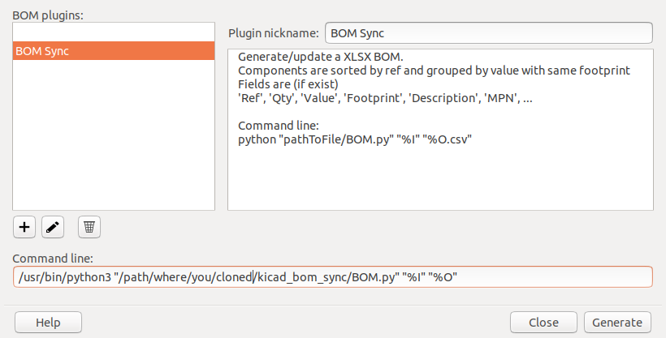

# KiCad BOM Sync
KiCad BOM plugin that syncs changes from KiCad to a spreadsheet.

## Concept
Most BOM tools simply export to CSV or XLSX. You would then manually edit the spreadsheet
(adding component price info, manufacturers, style, etc). But what if you then make changes to the design?

### Review changes from KiCad
This tool can not only create, but also update an existing XLSX spreadsheet with changes from KiCad.
It is basically a diff tool for the BOM: it highlights all changes that were made.
Obsolete entries are highligted in red instead of silently deleting them: this allows you to review for unexpected BOM cchanges.

You can accept incoming changes by simply removing the highlight and then saving the XLSX file. Or in case of obsolete rows, delete them. If you want to be sure a BOM is in sync with your design, simply run the script again: if nothing is highlighted, you know it is in sync!



# Installation

*NOTE:* this guide was written with linux (Ubuntu) in mind, but you should be able to run it on other platforms (MacOS) as well..

Clone this repository and install the required python package(s):

* openpyxl (>= 2.4): `pip install openpyxl`


## (Optional) install as KiCad plugin

This script is a BOM plugin just like the default plugin(s) shipped with KiCad.
In the scematic editor, click the `BOM`:



This should open the `Bill of Material` window, like the image below:



Here you may find one or more pre-installed BOM plugins. Click the `+` and locate the `BOM.py` file in this repository.
The command line in the end should look like this: `python3 "/path/where/you/cloned/kicad_bom_sync/BOM.py" "%I" "%O"`


# How to run the plugin

## Running as KiCad plugin

Open the `Bill of Material` from the schematic editor (see above). If all went well, you can select the BOM plugin in the left pane, and simply click `generate`. The right pane should give some feedback whether the script was run succesfully and the script will tell you what changes it made. The BOM file is generated as <projectname>.xlsx in the folder of your KiCad project.

## Alternative: running manually from the command line

The script expects two parameters: the KiCad Bom file (XML format) and the name of the output file.
First export the XML BOM from KiCad manually (for examply by running the default BOM plugin), then run the script to create/update the xlsx file:
```
python "pathToFile/BOM.py" "kicad-bom.xml" "my-project.xlsx"
```


# Workflow

## Creating a new BOM
The first time you run the `kicad_bom_sync` plugin in your project, the plugin automatically creates a new xlsx file. If the file already existed, it is updated as explained below.

## Syncing to an existing BOM
The script looks for a sheet called 'BOM' and assumes the first row are headers (such as 'Ref', 'Qty' etc) that are matched with the component fields from KiCad. This means the script will work even if you rearrange the order of the columns.

Components are grouped by value and footprint:
* Matching component found? Any non-empty fields from KiCad overwrite the values in the sheet and are marked yellow.
* No matching component (matching value + footprint) found? A new row is added and marked green.
* If the sheet has a column called 'Sync' (optional but highly recommended),
this is updated to '1' for matched components, or marked red for obsolete rows.

### Update: automatic footprint renaming
Since V0.5 the Kicad Footprint names are translated to simplify them. For example, the name of the footprint library is omitted and underscores are replaced with whitespace.
The script is backwards compatible with old BOMs, and will highlight renamed footprints in blue.

### Reviewing the changes

Review all highlights and remove the highlighting manually when you want: this allows you to see the differences if you run the script a next time.

**NOTE**: If a component changes significantly (the `Value` or `Footprint` changes), the script sees this as a deletion + insertion of a new component. You will see one row marked as obsolete (column `Sync` is red) next to a new (green) line.

## Editing the BOM file

You can fully customize the BOM file: add your own markup, reorder rows or colums, add things like a total count etc.
Even the columns can be reordered and some can be deleted: just make sure to leave at least the `Ref`, `Qty`, `Value` and `Footprint` columns in place (the script will look at the header row and recognises these keywords)

### Field values from KiCad override local edits

This plugin always sees data from KiCad as the absolute truth: while you are free to edit the `xlsx` BOM file how you like, any *non-empty fields* defined in KiCad will always override values in the  `xls` file. As an example, if you have edited the BOM to add the `MPN` value for a part manually, then:
* If the component has no `MPN` field (or it is empty) in KiCad: the BOM remains unchanged (your manual edit remains)
* If the component does have its `MPN` field specified: the BOM is updated with the value from KiCad (and highlighted yellow)


## Advanced features


### DNI: exclude parts from the BOM

You can exclude certain parts from the BOM by setting one of the following
properties in a KiCad component:
- Set its value to anything starting with 'DNI'
- Set its value to 'DNI', 'DNP', LOGO', 'mousebite' or 'inf'
- Add a 'DNI' field and set it to '1'


### Two way sync?

Unfortunately, syncing back changes from the BOM to the KiCad schematics is not supported (yet?). Terefore, the recommended workflow is to enter part information (such as MPN) in KiCad first, then sync it to the BOM.

